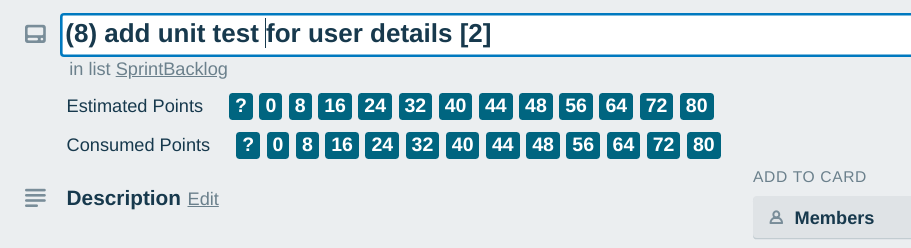
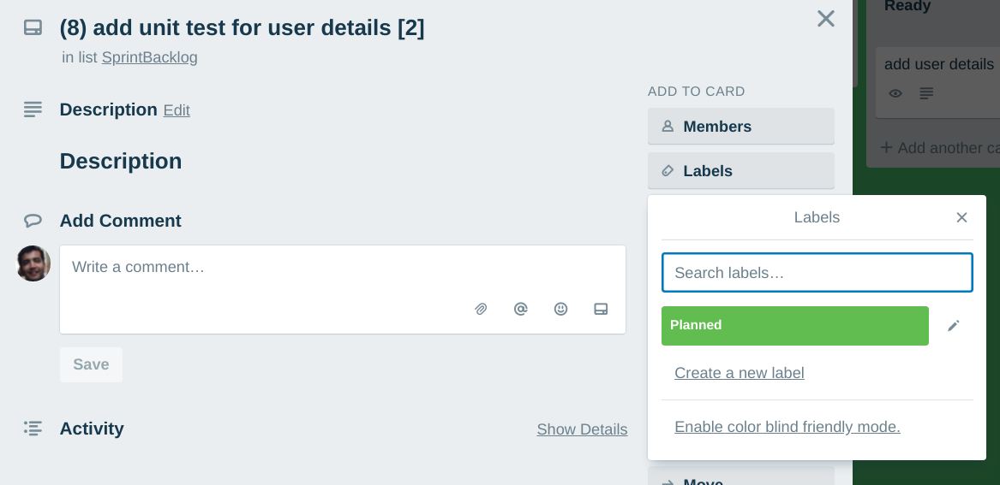
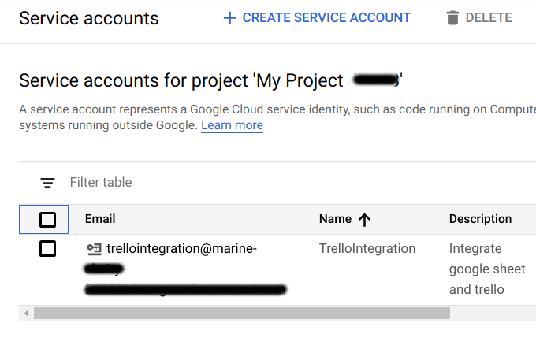
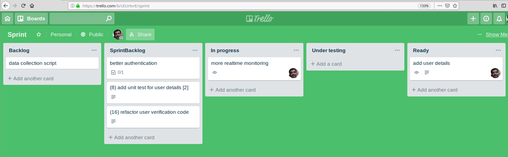
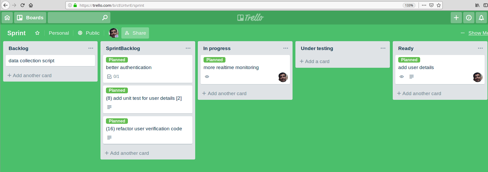
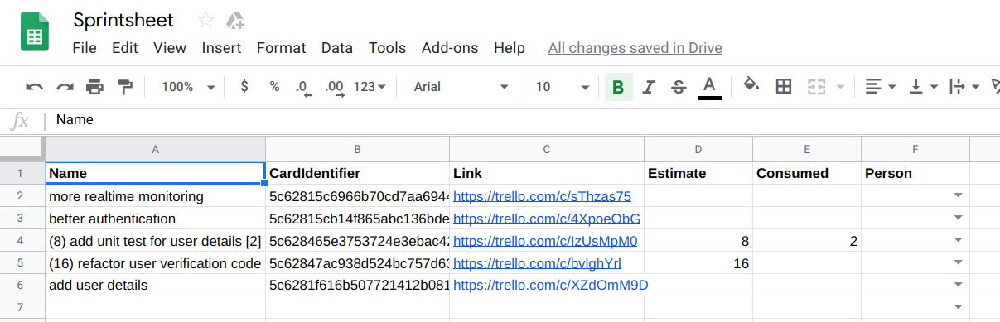

# trello-googlesheet-integration

Integrate trello with googlesheet for handling current sprint of your team. 

### Google sheet structure and usage

[Click here for the template](https://docs.google.com/spreadsheets/d/1t7CxFb01b_5xDnYzmantBxANexdUw2h_kLIXFxiQyvA/edit?usp=sharing).  To use the template just click on `File` then `Make a copy` and note down the spreadsheet id. For example, the URL of template is https://docs.google.com/spreadsheets/d/1t7CxFb01b_5xDnYzmantBxANexdUw2h_kLIXFxiQyvA/edit?usp=sharing,  `1t7CxFb01b_5xDnYzmantBxANexdUw2h_kLIXFxiQyvA` represent the spreadsheet id.

Please get spreadsheet id of your copy, as you would need when you will set up basic configurations.

Please refer [README](https://docs.google.com/spreadsheets/d/1t7CxFb01b_5xDnYzmantBxANexdUw2h_kLIXFxiQyvA/edit#gid=1934298268) sheet for more details on how the spreadsheet is structured. This template is inspired by http://sybrandt.com/post/google-slides-agile/.

### Trello

Refer https://trello.com/b/cEUrtvrE/sprint as trello board reference. 

We use [Scrum for Trello](https://chrome.google.com/webstore/detail/scrum-for-trello/jdbcdblgjdpmfninkoogcfpnkjmndgje?hl=en) extension to add estimated and consumed points else use the following format for title of your card `(estimated_points) title (consumed_points)`, see https://trello.com/c/IzUsMpM0/5-8-add-unit-test-for-user-details-2 for an example.



Please add a label that will be used to categorize cards as part of sprint, for example above board have `Planned` as label that will be used for this purpose.



### Set up basic configurations

Execute the following command to populate basic default configuration, like trello board details and googlesheet details, file based on input provided:

```bash
CONFIG_FILE_PATH=/tmp/default.json \
node setdefaults.js
```

It will prompt you to provide few configurations files, default values are enclosed in `()`, like: 

```
CONFIG_FILE_PATH=/tmp/default.json node setdefaults.js
prompt: Enter trello board id used for sprint: 5c62815ba5901b8e82fa2f41
prompt: List to exclude contains comma separated values for list to be excluded from fetching cards in corresponding list: (Backlog) 
prompt: Id for label used for cards in current sprint: 5c6281b3141ef65a6e30ac6f
prompt: Name for label used for cards in current sprint: (Planned) 
prompt: Enter trello board id used for release, that is, a separate board to handle completed sprint cards: 
prompt: List to exclude contains comma separated values for board list to be excluded from fetching cards in corresponding list: 
prompt: Googlesheet sheet name used to maintain current sprint backlog: (SprintBacklog) 
prompt: sheets.backlog.range: (!A2:Z) 
prompt: Googlesheet sheet name used to maintain unplanned cards added in current sprint: (Unplanned) 
prompt: sheets.unplanned.range: (!A3:Z) 
prompt: Googlesheet sheet name used to maintain status of planned cards of current sprint: (Sprint) 
prompt: sheets.sprint.range: (!A2:H) 
The config file successfully saved!
```

The structure of saved file, `/tmp/default.json`, is:

```json
{
  "trello": {
    "board": {
      "sprint": {
        "id": "5c62815ba5901b8e82fa2f41",
        "listToExclude": "Backlog",
        "sprintLabel": {
          "id": "5c6281b3141ef65a6e30ac6f",
          "name": "Planned"
        }
      },
      "release": {
        "id": "",
        "listToExclude": ""
      }
    }
  },
  "googlesheet": {
    "sheets": {
      "backlog": {
        "name": "SprintBacklog",
        "range": "!A2:Z"
      },
      "unplanned": {
        "name": "Unplanned",
        "range": "!A3:Z"
      },
      "sprint": {
        "name": "Sprint",
        "range": "!A2:H"
      }
    }
  }
}
```

### Perform an operation

Get a list of supported operations along with basic explanation

```bash
SUPPRESS_NO_CONFIG_WARNING=1 \
node main.js -h
```

or if you already have a config file from `Set up basic configuration` then use 

```bash
NODE_CONFIG_DIR=/tmp \
node main.js -h
```

The pre-requisite to perform any operation on googlesheet is to get key file for JWT using service account. Please read https://developers.google.com/identity/protocols/OAuth2ServiceAccount#jwt-auth on how to get it. Once done then add service account email to googlesheet and give it edit rights.



> service account email


> adding service account email to spreadsheet

provide path of your private key file to `GOOGLE_PRIVATE_KEY_FILE_PATH`

```bash
NODE_CONFIG_DIR=/tmp \
GOOGLE_SPREADSHEET_ID=<SPREADSHEET_ID> \
GOOGLE_PRIVATE_KEY_FILE_PATH=/tmp/token.json \
TRELLO_API_KEY=<API_KEY> \
TRELLO_API_TOKEN=<API_TOKEN> \
node main.js -o <operation_name>
```

Replace `<operation_name>` with a supported operation. Current supported operations are:

- `get` - get the list of entries in google spreadsheet (take additional option `--sheet`).

- `clear` - clear the list of entries in google spreadsheet (take additional option `--sheet`). Run this before you start sprint to start on clean slate.

  ```bash
  NODE_CONFIG_DIR=/tmp \
  GOOGLE_SPREADSHEET_ID=<SPREADSHEET_ID> \
  GOOGLE_PRIVATE_KEY_FILE_PATH=/tmp/token.json \
  TRELLO_API_KEY=<API_KEY> \
  TRELLO_API_TOKEN=<API_TOKEN> \
  node main.js -o clear -s backlog
  ```

  > clear backlog sheet

  ```bash
  NODE_CONFIG_DIR=/tmp \
  GOOGLE_SPREADSHEET_ID=<SPREADSHEET_ID> \
  GOOGLE_PRIVATE_KEY_FILE_PATH=/tmp/token.json \
  TRELLO_API_KEY=<API_KEY> \
  TRELLO_API_TOKEN=<API_TOKEN> \
  node main.js -o clear -s unplanned
  ```

  > clear unplanned sheet

- `addSprintLabel` - add sprint label, default is `Planned`, to cards in trello board (perform this at starting of sprint).

  Consider you are about to start the sprint and all the cards that needs to be included in current sprint are added to the board. 

  

  Now when you run this command

  ```bash
  NODE_CONFIG_DIR=/tmp \
  GOOGLE_SPREADSHEET_ID=<SPREADSHEET_ID> \
  GOOGLE_PRIVATE_KEY_FILE_PATH=/tmp/token.json \
  TRELLO_API_KEY=<API_KEY> \
  TRELLO_API_TOKEN=<API_TOKEN> \
  node main.js -o addSprintLabel
  ```

  then it will add sprint label, in this case `Planned`, to the cards

  

- `createBacklog`  - fetch cards in the current sprint from trello board and write them to google spreadsheet (perform this at starting of each sprint). When you run the following command

  ```bash
  NODE_CONFIG_DIR=/tmp \
  GOOGLE_SPREADSHEET_ID=<SPREADSHEET_ID> \
  GOOGLE_PRIVATE_KEY_FILE_PATH=/tmp/token.json \
  TRELLO_API_KEY=<API_KEY> \
  TRELLO_API_TOKEN=<API_TOKEN> \
  node main.js -o createBacklog
  ```

  it will add trello cards marked with sprint label, `Planned`, to the `SprintBacklog` sheet

  

- `addToUnplanned` - add/update cards that were added in between sprint to the unplanned google spreadsheet.  This is useful for tracking cards that are added in between the sprint. It will pick all cards that don't have sprint label added to them and add to `Unplanned` sheet.

- `updateSheet` - read current entries present in sheet then fetch corresponding card details from trello and update accordingly. This is useful to update existing entries in spreadsheet in case trello card details have changed, details like title, estimated and consumed points.
